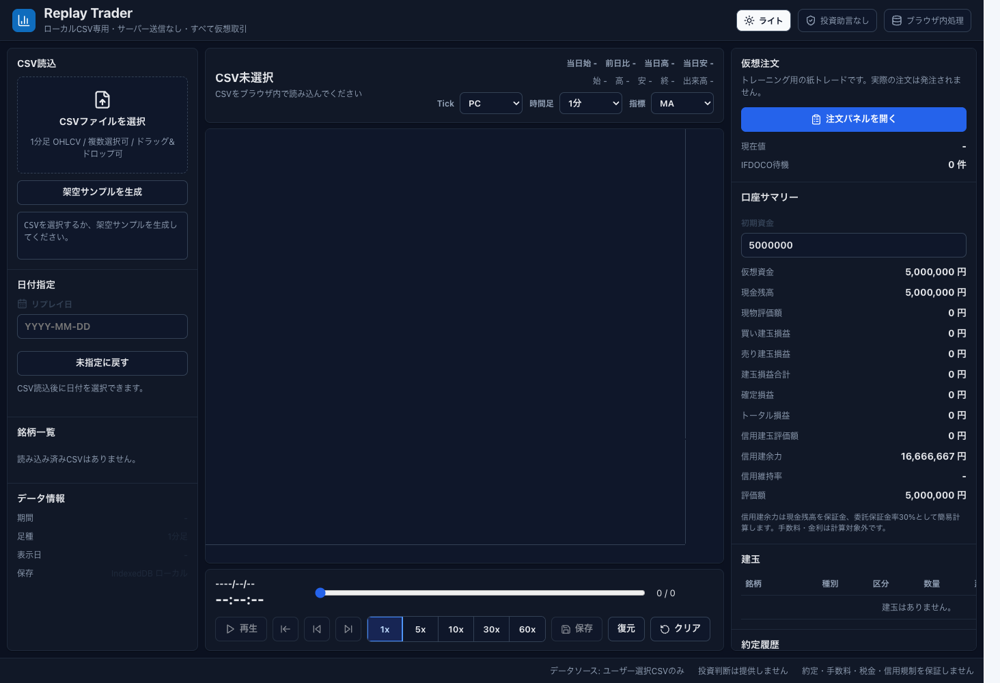
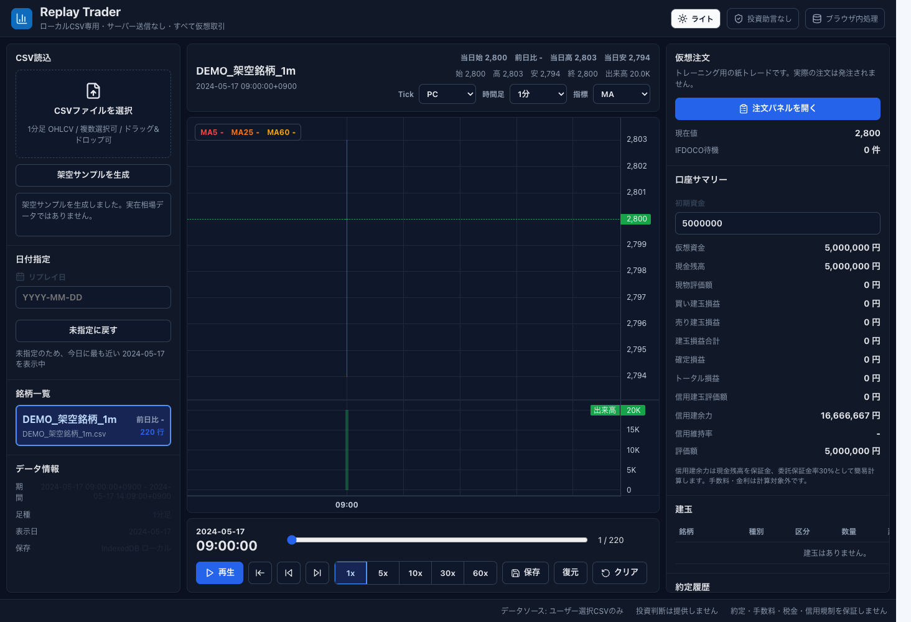
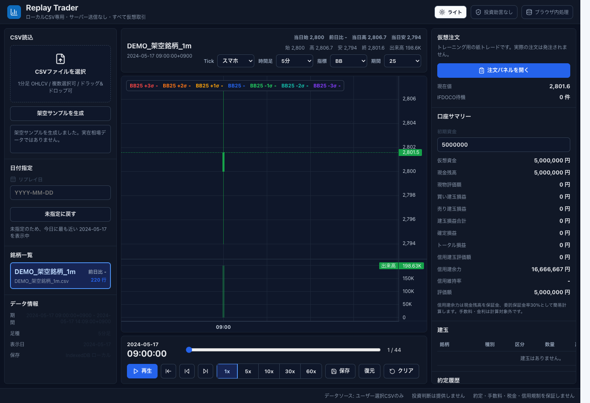
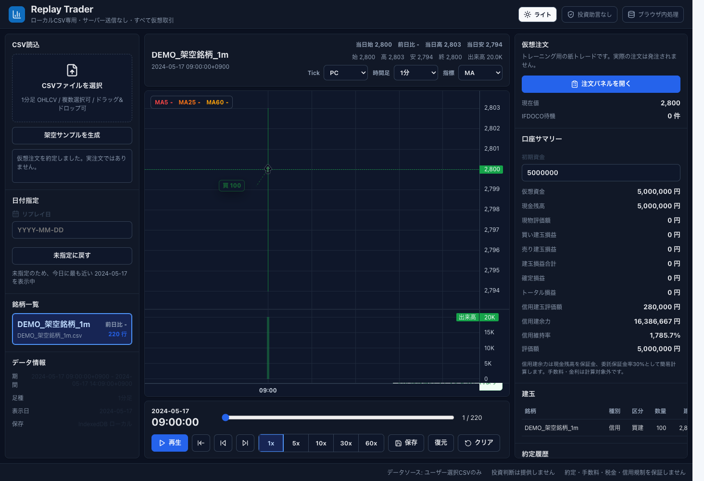
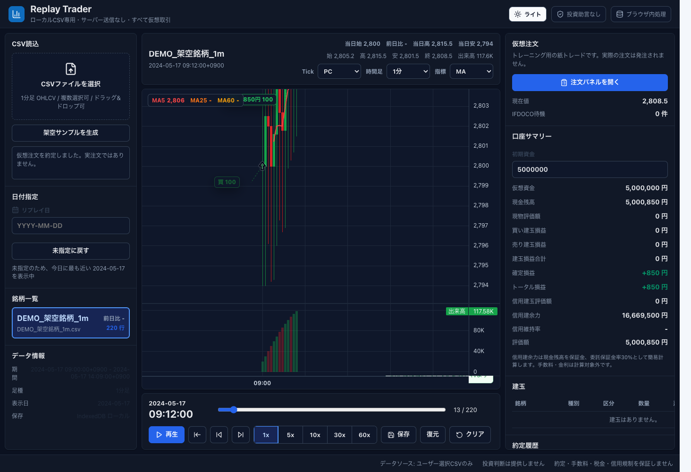
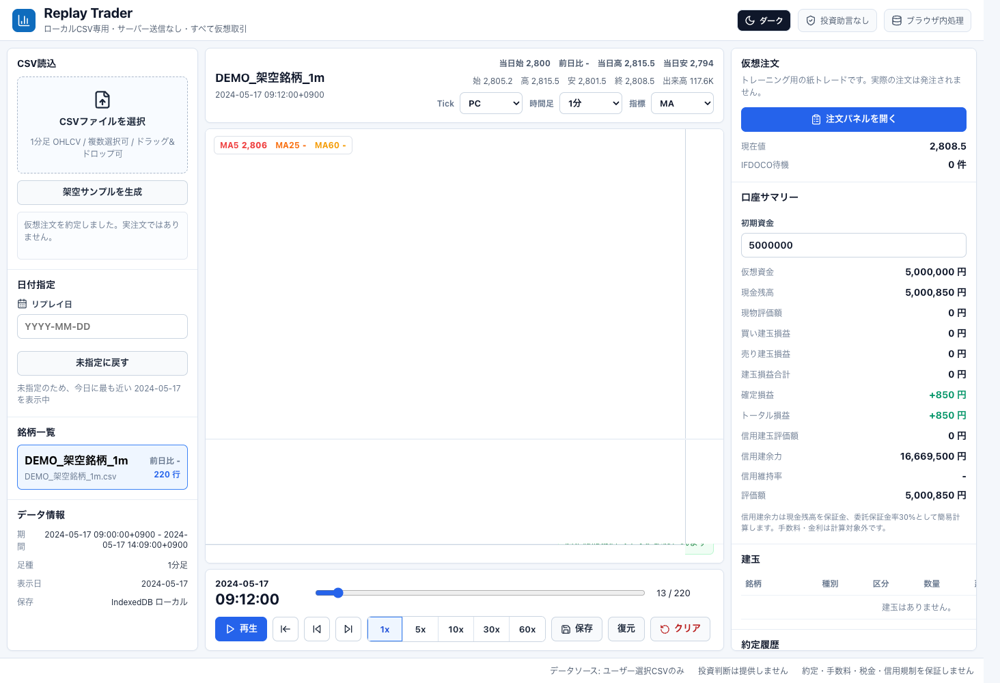

# Replay Trader

CSVをブラウザ内で読み込む、実注文なしのトレードリプレイトレーニングアプリです。

## 特徴

- GitHub Pages で配信できる静的 React/Vite アプリ
- CSV は File API でブラウザ内だけで処理
- サーバーアップロードなし
- 日付指定付きの1分足 OHLCV リプレイ
- 指定日がない場合は最も近い日付のデータを自動選択
- チャートは指定日と直近2営業日分を表示。非営業日は除外してX軸を連続表示
- チャート右上のピッカーでTickモード、1分足/5分足、MA/BBを切り替え
- 再生速度は1xをデフォルト表示。1xは実時間基準でローソク足を進行
- 再生中は現在のローソク足の範囲内で価格をランダムウォークさせ、ヒゲ、時刻の秒、出来高を更新
- ランダムウォークの価格はTOPIX500構成銘柄の呼値に丸めて表示
- Tick回数は出来高に連動。PCモードは60〜2400tick、スマホモードは取引株数/100を上限120tickで計算
- 5、25、60期間の移動平均線を表示。選択日の先頭では前日以前のデータも使って計算
- ボリンジャーバンド表示に切り替え可能。期間は10、20、25、50、75から選択
- 当日始値、前日比、当日高値、当日安値をチャート上部に表示。前日比プラスは緑、マイナスは赤
- ダークモードをデフォルト表示。ライト/ダークモード切り替え
- 通常注文とIFDOCOの仮想注文
- 注文パネルはフロート表示で移動可能
- 初期資金はデフォルト500万円で、画面から変更可能
- 信用維持率を表示
- 信用建余力を表示。現金残高を保証金、委託保証金率30%として簡易計算
- 手数料・金利は計算対象外
- 日跨ぎ建玉がある場合、新規注文を拒否
- 現物と信用建玉を別管理。信用建玉は建値ごとに管理し、分割決済可能
- 建玉、約定履歴、損益のローカル表示
- 売買マーカーをチャート上に表示。決済マーカーは損益プラスを丸、マイナスをバツで表示
- IndexedDB へのローカル保存/復元

## CSV 形式

```csv
Datetime,Close,High,Low,Open,Volume
2026-02-19 09:05:00+0900,4145.0,4170.0,4130.0,4170.0,0
```

必須カラムは `Datetime,Close,High,Low,Open,Volume` です。`Datetime` は `+0900` のようなオフセット付き日時として解釈します。

`Volume` は売買代金ではなく取引株数として扱います。5分足では、対象の1分足5本分の `Volume` を合算して表示します。

## 開発

```bash
npm install
npm run dev
npm run test
npm run build
npx playwright test
```

## 公開時の注意

- 実在の相場 CSV を repository、`public/`、`dist/` に入れないでください。
- 本番公開ビルドには架空サンプル生成機能だけを含めます。
- このアプリは投資判断、売買推奨、実注文機能を提供しません。
- 表示される損益、信用維持率、信用建余力は過去データに基づく仮想計算で、実際の約定・手数料・金利・税金・信用規制を再現するものではありません。

## 公開用ドキュメント

- [免責事項](docs/disclaimer.md)
- [利用規約](docs/terms.md)
- [プライバシーポリシー](docs/privacy-policy.md)
- [データ取扱方針](docs/data-handling-policy.md)
- [公開前チェックリスト](docs/pre-release-checklist.md)

## ライセンス

このプロジェクトのアプリ本体のソースコードは [MIT License](LICENSE) で公開します。

第三者ライブラリのライセンス表示は [THIRD_PARTY_NOTICES.md](THIRD_PARTY_NOTICES.md) を参照してください。

チャート描画には `lightweight-charts` を利用しています。`lightweight-charts` は Apache License 2.0 の OSS として提供されています。

このリポジトリには相場データを含めません。ユーザーが読み込む CSV データの権利、契約条件、利用可否はユーザー自身が確認してください。

このアプリはトレードリプレイと学習目的のツールです。投資助言、売買推奨、金融商品取引業、注文取次、実資金による取引機能は提供しません。

## チュートリアル

Replay Trader は、ユーザー自身が用意した1分足 CSV をブラウザ内で読み込み、過去チャートをリプレイしながら仮想売買を練習するためのアプリです。CSV はサーバーへ送信されません。

このチュートリアルの画面は、アプリ内の「架空サンプルを生成」で作成したデータを使っています。実在相場データではありません。

### 1. アプリを開く

初期表示では、左側に CSV 読込、中央にチャート、右側に仮想注文と口座サマリーが表示されます。デフォルトはダークモードです。



### 2. CSV を読み込む

左側の「CSVファイルを選択」から CSV を選びます。ファイルはドラッグ&ドロップでも読み込めます。

検証や操作練習だけをしたい場合は、「架空サンプルを生成」を押すと、実在相場ではないサンプルデータで画面を確認できます。



CSV は次の列を含む必要があります。

```csv
Datetime,Close,High,Low,Open,Volume
2026-02-19 09:05:00+0900,4145.0,4170.0,4130.0,4170.0,0
```

### 3. 日付と時間足を指定する

左側の「リプレイ日」に日付を入力すると、その日のデータを表示します。指定日にデータがない場合は、最も近い日付のデータを自動で選びます。

チャート右上では、Tickモード、時間足、指標を切り替えられます。

- Tick: `PC` / `スマホ`
- 時間足: `1分` / `5分`
- 指標: `MA` / `BB`

日付指定時は、指定日と直近2営業日分のチャートを表示します。土日祝などCSVに存在しない非営業日はX軸から除外されるため、週を跨いでもチャートは連続して表示されます。

チャート上部には、当日始値、前日比、当日高値、当日安値が表示されます。前日比はプラスが緑、マイナスが赤です。



### 4. リプレイを操作する

チャート下部のスライダー、再生ボタン、前後移動ボタンでリプレイ位置を操作します。

再生速度のデフォルトは `1x` です。再生速度は実時間基準で、1x は1分足なら1分ごと、5分足なら5分ごとにローソク足が1本進みます。5x、10x、30x、60x はその倍率で進みます。

再生中は、現在のローソク足の範囲内で価格がランダムウォークし、ヒゲ、時刻の秒、出来高も更新されます。ランダムウォークの価格は、TOPIX500構成銘柄の呼値に合わせて丸められます。

Tickモードごとの更新回数は次の通りです。

- PC: CSV内の出来高順位に応じて60〜2400tick
- スマホ: 取引株数/100。12000株以上は120tickで固定

出来高は売買代金ではなく取引株数です。

### 5. 仮想注文を出す

右側の「注文パネルを開く」を押すと、フロート型の注文パネルが開きます。パネルはドラッグして位置を動かせます。

通常注文では、取引区分、注文種別、数量、指値価格を設定します。

- 現物: 現物の買い、保有分の売却
- 信用新規: 信用の買建、売建
- 信用返済: 信用建玉の返済
- 数量: 100株単位
- 成行: 現在のリプレイ価格で約定
- 指値: 条件に合う場合だけ約定

IFDOCOでは、新規注文と、利確・損切りの返済条件をまとめて登録できます。実注文は送信されず、すべてブラウザ内の仮想注文として処理されます。

下の例では、信用新規の買い注文を約定し、建玉と約定履歴に反映されています。



### 6. 建玉と損益を確認する

右側の「口座サマリー」では、仮想資金、現金残高、現物評価額、買い建玉損益、売り建玉損益、確定損益、トータル損益、信用建余力、信用維持率を確認できます。

「建玉」では、現物と信用が別々に表示されます。信用建玉は建値ごとに管理され、返済時は分割決済できます。

### 7. 信用建玉を返済する

信用建玉を返済するときは、取引区分を「信用返済」に変更し、買建を閉じる場合は「売り注文」、売建を閉じる場合は「買い注文」を押します。

決済後は確定損益に反映され、チャート上にも売買マークが表示されます。利益が出た決済は緑の丸、損失が出た決済は赤いバツで表示されます。



### 8. テーマを切り替える

右上の「ライト」「ダーク」ボタンで表示テーマを切り替えられます。



### 9. 保存と復元

「保存」を押すと、読み込んだデータ、リプレイ位置、仮想取引状態をブラウザ内の IndexedDB に保存します。外部サーバーには送信されません。

「復元」を押すと、同じブラウザに保存済みのセッションを読み込みます。「クリア」を押すと、仮想取引と保存セッションを削除します。

### 注意事項

- このアプリはトレーニング用の仮想取引ツールです。
- 実注文、注文取次、投資助言、売買推奨は行いません。
- 表示される損益、信用建余力、信用維持率は簡易計算です。
- 手数料、金利、税金、実際の信用規制は計算対象外です。
- CSV データの権利、契約条件、利用可否はユーザー自身で確認してください。
